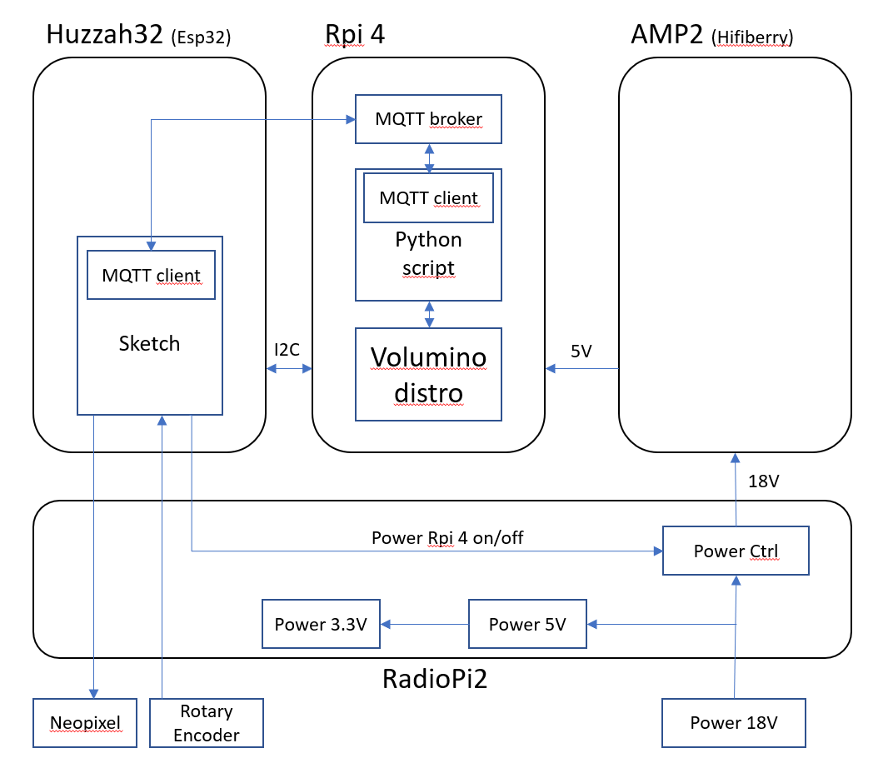
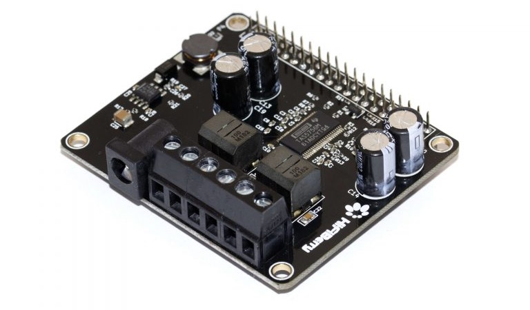

# RadioPi
Repository for a raspberry pi based radio project. An overview of the system is shown in the following picture:

The system is based on four main parts:

1. **Raspberry Pi 4**: The internet radio is running on the raspberry pi 4 using the [volumio](https://volumio.org/) distribution. Aside from the distribuition, an mosquitto mqtt broker is launched at startup using systemctl. This is used to send an receive messages between the different mqtt clients. One of these clients is a python script, which runs also on the raspberry pi 4. This scipt is also launched as a service using systemctl and can control the music played from the volumio distribution. Used controls are increasing and decreasing of the volume, as well as play/pause the music. The code for the script, as well as the setup of the volumio-sd-card can be found [here](https://github.com/frep/RadioPi/tree/main/RadioPiRPi4)

2. **AMP2**: The speaker of the radio is connected to the raspberry pi by using the amplifier board [amp2](https://www.hifiberry.com/shop/boards/hifiberry-amp2/) from the company hifiberry.com.

3. **HUZZAH32**: An [Adafruit HUZZAH32](https://www.adafruit.com/product/3405) feather board is used to read the rotary encoder events and generate mqtt messages, which are send over wifi to the mqtt broker, running on the raspberry pi. For this reason, an mqtt client is implemented on the esp32 sketch. A little neopixel stip, containing eight neopixel, are controlled by the microcontroller, to indicate that the encoder is turned or pressed. The power for the raspberry pi and the amp2 board is also controlled by the microcontroller. The code, running on the microcontroller can be found [here](https://github.com/frep/RadioPi/tree/main/RadioPiEsp32Ctrl)

4. **RadioPi PCB**: The different parts are connected with this little pcb. It can be stacked on the amp2. It contains headers to connect the Huzzah32 board, as well as the rotary encoder an the neopixel stripe. It takes care off the different logic levels of the microcontroller and neopixel. It also contains a relay to control the power delivered by the power adapter GS60A18-P1J (60W, 18V with 3.33A) to the amp2 (and from there to the raspberry pi). The documentation, as well as the gerber-files to produce the pcb can be found [here](https://github.com/frep/RadioPi/tree/main/RadioPiPCB)
