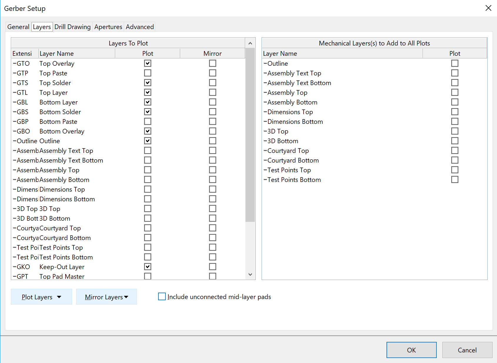

RadioPi PCB
===========
The RadioPi PCB (v2) connects the MCU board [Adafruit HUZZAH32](https://www.adafruit.com/product/3405) as well as the RotaryEncoder and the Neopixels with the Raspberry Pi (including the Hifiberry Amp2 addon). The power is also controlled by the MCU.

Circuit maker
-------------
The PCB is designed with the Circuit maker program. The files can found [here](https://circuitmaker.com/Projects/Details/PASCAL-FREHNER/RadioPi2).

Gerber settings
---------------
To generate the gerber files, the following settings are used:

From the generated outputs the following files have to be put into a single .zip file:
- RadioPi-RoundHoles.TXT
- RadioPi-SlotHoles.TXT
- RadioPi.DRR
- RadioPi.EXTREP
- RadioPi.GBL
- RadioPi.GBO
- RadioPi.GBS
- RadioPi.GKO
- RadioPi.GTL
- RadioPi.GTO
- RadioPi.GTS
- RadioPi.LDP
- RadioPi.Outline
- RadioPi.REP
- RadioPi.RUL

