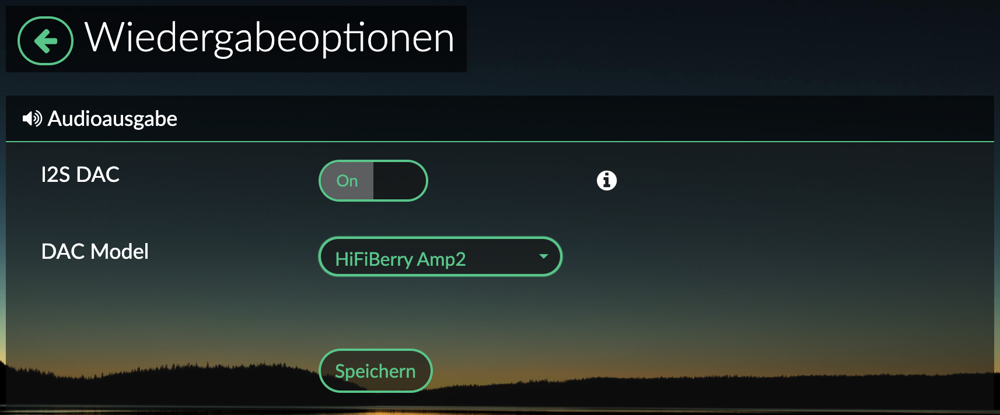
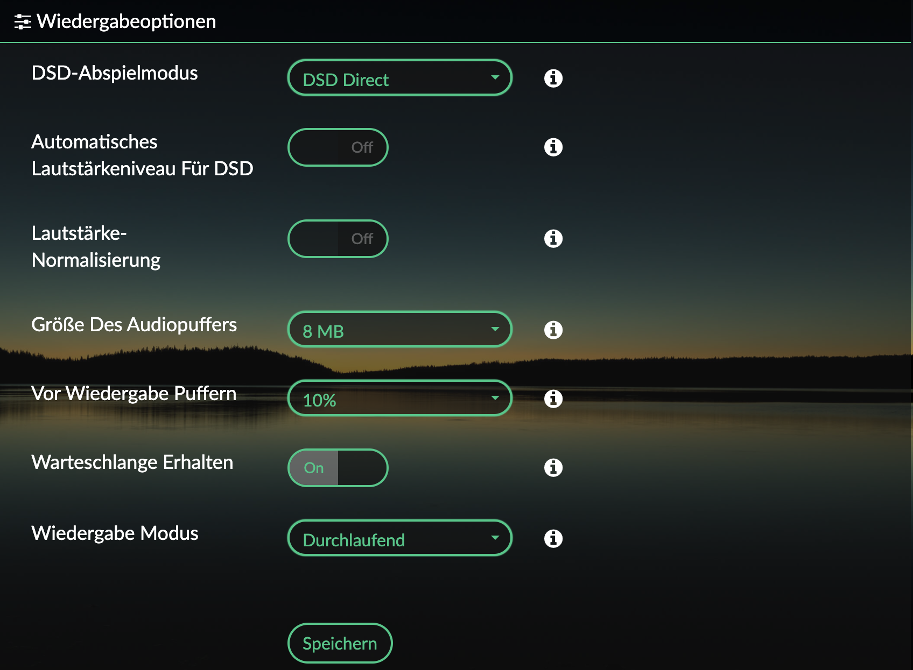
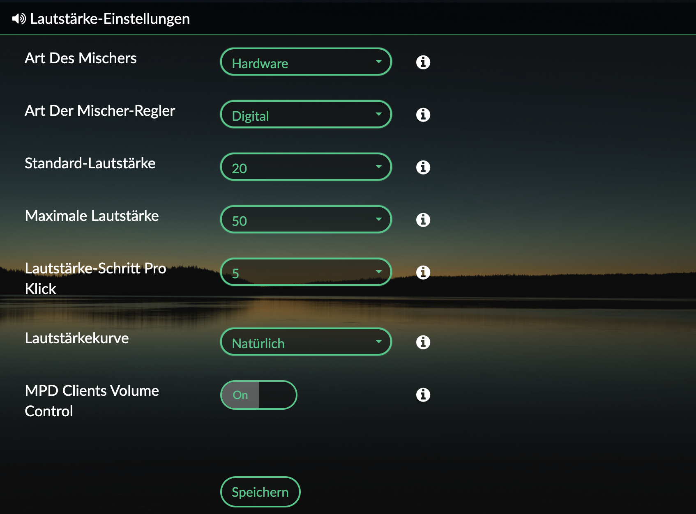

RaspberryPi 4 setup
===================
The RadioPi project is based on the [volumio](https://volumio.org/) distribution.

Volumio setup
-------------
At the time of the setup, the actual image for the raspberry pi was **volumio-2.861-2020-12-22-pi.img**. After an inital setup, the following setting are needed, to support the used [Hifiberry](https://www.hifiberry.com/) Amp2 amplifier:

- **Enable ssh**: http://volumio.local/dev/

MQTT setup
----------
A connection to the raspberry pi, can be done with ssh:
> ssh volumio@volumio.local

To get a MQTT broker running on the rpi, the following commands are needed.	 

>     sudo apt-get update
>     sudo apt-get install -y mosquitto mosquitto-clients
>     sudo systemctl enable mosquitto.service

To get the mosquitto broker working after a reboot, the following modification in the file **/etc/mosquitto/mosquitto.conf** was needed:

Comment the following line out:
> log_dest file /var/log/mosquitto/mosquitto.log

Python setup
------------
To control the volumio distribution with mqtt messages, a python script is used to make the connection. To make the script running, the following modifications were needed:

>     sudo apt-get install -y python-pip
>     sudo pip install paho-mqtt

Add local music files
---------------------
In case you want to add music files locally on the sd card, the files can be stored at:
> /data/INTERNAL
